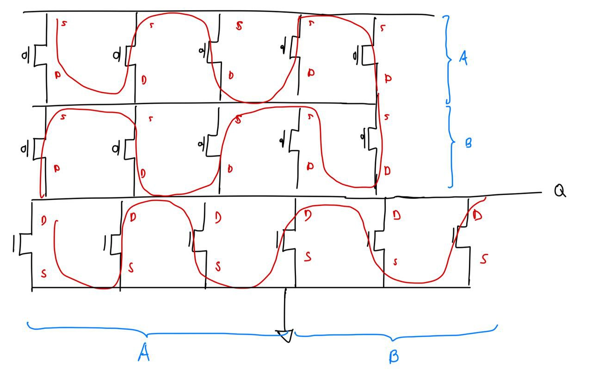

# Tarea_2_VLSI_II_2024

Integrantes:

* Francisco Coto Alcázar
* Bernal Zamora Barrantes
* Andrés Rojas Barboza

## 1. Introducción

En esta tarea se resolverá el Problema 9.4 de [1] mediante tecnicas de estimación y simulación. Primeramente, se darán estimados de retardo y consumo de promedio de potencia (suponiendo una frecuencia operación de a máxima frecuencia posible) para dos soluciones, una con una compuerta compleja más un inversor y una con 3 compuertas complejas nors. Se utulizarán los métodos de Esfuerzo Lógico con la intencion de optener el ancho de los transistores a utilizar y Elmore Delay para calcular el tiempo de retraso de las puertas y la teoria de potencia para el calculo de la potencia. Posteriormente, se realizó la simulación mediante modelado HSPICE y por último, se diseño un layout que minimalice las capacitancias y se realizó la simulación post-trazado y se compararon los resultados.  Todos los calculos pueden apreciarse en el pdf del repositorio llamado "Cálculos.pdf"

### 1.1 Problema 9.4

A contunuacion se muestra el problema 9.4.

## 2. Datos 

* Uso de la tecnología XH018
* Simulador: HSpice
* Herramienta de diseño: custom compiler
* λ = 90µm.
* SUPPLY = 1.8V

## 3. Resultados

### 3.1. Construcción de las soluciones

Las 2 soluciones a utilzar corresponde a un diseño un compuerta compleja en tecnología CMOS más un inversor y  el diseño con la utilización de compuertas más sencillas de texnologia CMOS, para este caso compuertas NORS debido a que este diseño cumple las funcion lógica mostrada en el problema.

El diseño de la solución con compuerta compleja corresponde a. 

Por otra parte, para el diseño de la compuerta compleja primeramente se planteo la función lógica en terminos de compuerta simples. Luego de estos se cambiaron por compuertas de tecnología CMOS más inversores. Por último, se utilizó el método de bubble pushing para transformar todo el diseño en tecnología CMOS.

### 3.2. Delay mediante esfuerzo lógico para el diseño OR-OR-AND-INVERTER + INVERTER

#### 3.2.1. Cálculo Teórico del Delay y obtención de los anchos de los transistores. 

Primeramente, se analizó el mejor número de etapas que debe presentar el diseño. Esto con el valor de la capacitancia de entrada y el de la capacitancia que debe ser capaz de manejar, dando como resultado que el mejor número de etapas corresponde a 2. 

$$ N = log_4(\frac{500}{30}) = 2.02$$

Por lo que el diseño de una compuerta compleja más un inversor es una solución eficiente para la función lógica establecida. Por lo que se procedio a calcular el esfuerzo que debe tener cada etapa para obtener una aproximación al mejor tiempo. 

Para esto primeramente debemos obtener las constantes de delay parasito y esfurzo lógico para nuestra compuerta compleja. Para esto proponemos primeramente un diseño con transistores unitarios, calculamos las capacitancias en cada nodo y obtenemos las constantes normalizado las capacit a un invesor de tamaño unitario.

Los resultados obtenidos correspondieron a. 

$$ g_A = g_B = g_C = g_D = 2 $$

$$ p = 4 $$

Luego de estos se procedio a calcular el mejor esfuerza para cada etapa, este corresponde a. 

$$ G = (g_{compleja})(g_{inv}) = 2 * 1 = 2 $$
$$ H = 500/30 $$
$$ B = 1 $$

$$F = GBH = (2)(50/3)(1) = 100/3$$

Por lo tanto, el mejor esfuerzo corresponde a. 

$$ f = \sqrt{100/3} = 5.77$$

Por lo que cada etapa debe tener un esfuerzo de 5.77, por lo que se calculó las capacitancias de entrada de cada etapa. La primera etapa el enunciado menciona que debe poseer un valor de 30 lambda, por otra parte, la capacitancia de entrada debe calcularse de la siguiente manera. Recuerde que estos numeros son dependientes de lambda.

$$ C_{in} = \frac{C_{out} \cdot g_{inv }}{f} = \frac{ 500}{5.77} = 87 $$

Por ende, la capacitancia de entrada del inversor debe corresponde a 87 lambda. Respetando la relación 2 1 para tener el mejor tiempo los anchos de los transistores para el diseño corresponden a. 

Conociendo que nuestro $$ \lambda $$ corresponde a 90 nm.

Por último, se estimo el Delay de la compuerta mediante la teoría de esfuerzo lógico. 

$$ D = N(f)^{\frac{1}{2}}+P = 2(5.77)^{\frac{1}{2}}+4 = 16.55 \tau = 219 ps$$

con 

$$ \tau = 3RC = 13,26 ps$$

### 3.3. Delay mediante esfuerzo lógico para el diseño NOR - NOR + NOR

#### 3.3.1. Cálculo Teórico del Delay y obtención de los anchos de los transistores. 

 Para el diseño de con 2 etapas de nors, se procedio el mismo metodo obteniendo tomando en cuenta que los esfuerzos logico y el delay parasítico son conocidos y que el enunciado menciona que la capacitancia de entrada debe ser de 30 lambda.

 $$ G = g_{nor} \cdot g_{nor}  = \frac{5}{3} \cdot \frac{5}{3} = \frac{25}{9}$$
 $$ H = \frac{500}{30} = \frac{50}{3} $$
 $$ B = 1 $$
 $$ F = (G)(H)(B) = \frac{1250}{27} $$

 Por lo que el mejor esfuerzo por etapa corresponde. 

 $$ f = \sqrt(\frac{1250}{27}) = 6.80$$

Nuevamente, según enunciado tenemos que el ancho de la compuerta de entrada debe ser 30 \lambda a fuerza, por ende respentando la relación 2 a 1. Por ende, para la primera NORS el diseño corresponde. 

Para la segunda etapa partiendo de la teoría de esfuerzo lógico, tenemos que la capacitancia de entrada de la segunda etapa de NORS.

$$ C_{in} = \frac{C_{out} \cdot g_{nors}}{f} = \frac{ 500 \cdot \frac{5}{3}}{6.8} = 123$$

De nuevo, tomando en cuenta la relacion 2/1, tenemos el diseño con los anchos en terminos de lambda.

Por otra parte, el Delay según el esfuerzo lógico tenemos que corresponde a 17.71 $\tau$

$$ D = D = N(f)^{\frac{1}{2}}+P = 2(6.8)^{\frac{1}{2}} + 4 = 17.61 \tau = 233 ps $$

### 3.4. Estimación de la potencia consumida para el diseño OR-OR-AND-INVERTER + INVERTER

#### 3.4.1 Cálculo Teórico

Para la estimación de la potencia consumida para el diseño de compuerta compleja primeramente se calculó la máxima frecuencia a la cual nuestra compuerta puede llegar a tener un cambio la cual corresponde al inverso del tiempo de dalay. 

$$ F_{compleja} = \frac{1}{delay} = \frac{1}{219 ps} = 4.58 GHz $$

Por otra parte, para encontrar el factor de actividad se tomo que toda las probabilidades de ser 1 de las entradas corresponde a 0.5 y dado la ecuación lógica del problema se optiene que. 

$$ \alpha = 0.31 $$

Posteriormente se sumo el área total utilizada para la realización del cicuito y se multiplico por la capacitacia de normalizada en terminos de lambda. 

$$ \frac{0.33 fF}{220 nm} \cdot \frac{ 90 nm }{1 \lambda} = 0.135 \frac{fF}{\lambda} $$

Por ende la capacitancia del circuito corresponde a 

$$ C =  207 \lambda \cdot \frac{0.135}{\lambda} = 27.95 fF$$ 

Por lo tanto, la potencia estimada corresponde a. 

$$ P = (0.31)(1.8 V)^(2)(4.56 GHz)(27.95 fF) = 128.46 \mu W$$

### 3.5. Estimación de la potencia consumida para el diseño NOR + NOR + NOR

#### 3.5.1. Cálculo Teórico

Para la estimación de la potencia se replicó el proceso anterior cambiando el área y la frecuencia máxima para esta implementación por lo que se tiene. 

$$ F_{compleja} = \frac{1}{delay} = \frac{1}{233 ps} = 4.29 GHz $$

$$ C =  370 \lambda \cdot \frac{0.135}{\lambda} = 49.95 fF$$ 

$$ P = (0.31)(1.8 V)^(2)(4.56 GHz)(49.95 fF) =  215.22 \mu W$$

### 3.6. Delay mediante Elmore Delay para el diseño OR-OR-AND-INVERTER + INVERTER

#### 3.6.1. Cálculo Teórico

Para el cálculo teórico se realizó las redes RC de primer orden para los mejores y peores casos de rize y fall obteniendo los siguiente resultados. Los calculos específico pueden observcarse en el archivo "Calculos.pdf"

|Caso         | Transistores Encendidos | $Tiempo [ps]$  | 
|  :---       | ---                     |  ---:          | 
|tpdr         | C y D                   |  597.97        | 
|tcdr         | A y B                   |  526.22        | 
|tpdf         | C y A                   |  561.54        | 
|tcdf         | D y A                   |  525.98        | 

#### 3.6.2. Simulación

Para la simulación se realizó el esquemático del circuito, se exportó el HSIPICE y se simularon los casos expuestos anteriormente. 

|Caso         | Transistores Encendidos | $Tiempo [ps]$  | 
|  :---       | ---                     |  ---:          | 
|tpdr         | C y D                   |  258.2         | 
|tcdr         | A y B                   |  240.7        |
|tpdf         | C y A                   |  304.2         | 
|tcdf         | D y A                   |  295.6         | 

### 3.7. Delay mediante Elmore Delay para el diseño NOR + NOR + NOR

#### 3.7.1. Cálculo Teórico

Al igual que en el caso anterior se realizó las redes RC de primer orden para los mejores y peores casos de rize y fall tomando en cuenta todas las etapas obteniendo los siguiente resultados. Estos cálculos específicos pueden observcarse en el archivo "Calculos.pdf"

|Caso         | Transistores Encendidos         | $Tiempo [ps]$  | 
|  :---       | ---                             |  ---:          | 
|tpdr         | Solo se puede dar de una manera |  225.52        | 
|tcdr         | Solo se puede dar de una manera |  134.48        | 
|tpdf         | NOR1                            |  268.67        |  
|tcdf         | NOR1 NOR2                       |  193.82        | 

#### 3.7.2. Simulación

Al igual que en el caso anterior se reprodujieron los mejores y peores casos mediante simulación para obtener los tiempos. Las mediciones correspondieron a. 

|Caso         | Transistores Encendidos         | $Tiempo [ps]$  | 
|  :---       | ---                             |  ---:          | 
|tpdr         | Solo se puede dar de una manera |  264.3         | 
|tcdr         | Solo se puede dar de una manera |  205.4         | 
|tpdf         | NOR1                            |  304.2         |  
|tcdf         | NOR1 NOR2                       |  257.3         | 

### 3.8. Trazado del diseño OR-OR-AND-INVERTER + INVERTER

#### 3.8.1 Diagrama de palitos

Debido al ancho necesario de los transistores se procedió a diseñar un diagrama de palitos tomando en cuenta transistores unitarios en paralelo para alcanzar sus anchos. Lo que conllevó al siguiente diagrama de palitos.

#### 3.8.2. Trazado en coustom compiler

Partiendo del diagrama de palitos se realizó el trazado utilizado la herramienta custom compiler de synopsis. 

Posteriormente se realizó el trazado de la compuerta NOT que lleva el diseño completo de la función lógica. 

#### 3.8.3. Simulación Post-trazado

Para la realización de la simulación post-trazado primeramente extraimos las capacitancias parasistas del layout realizado. Posteriormente, realizamos un equemetático que incvolucrará un estimulo donde las señales de entreda estuvieses oscilando a la myor frecuencia posible, la el layout de la compuerta not y el layout de la compuerta compleja. Esto se puede observar la siguiente imagen. 

Por último, se porecio a observar el comportamiento del circuito mostrado en la siguiente figura. 

Posteriormente, para realizar el analisis de la potencia mediante una integral se acomuló la corriente de salida de la y se divido entre el periodo para sacar la corriente promedio, y se multiplico por la tensión. Esto basandonos en la teória de que la potencia entregada corresponde a la potencia consumida, dando como resultados que la potencia promedio corresponde a. 

$$ P = 331 \mu W $$

3.9 ### Trazado del diseño NOR + NOR + NOR
En este apartado se resumen todas las pautas tomadas para el diseño de la compuerta NOR + NOR + NOR, tomando en cuenta las especificaciónes del problema se estableció que los tamaños de la NOR de la primera etapa tendria 24$\lambda$ equivalente a 2,16$\mu$m para el pull up y 6$\lambda$ equivalente a 540nm para el pull down, justo como se muestra en la siguiente imagen:

Para la segunta etapa se tiene para el pull up 100$\lambda$ equivalentes a 9$\mu$m y para el pull down se tienen 25$\lambda$ equivalentes a 2,25$\mu$m, el resultado se puede apreciar en la siguiente figura:

Cabe destacar que debido a esto para cumplir con las especificaciónes y mantener un tamaño de compuerta de 4,48$\mu m$ y el ancho se opto por establecer un tamaño especifico para los transistores y ponerlos en paralelo, justo como se muestra en la siguiente imagen para ambas etapas:

 <!-- Aun no lo he diseñado -->

#### 3.9.1 Diagrama de palitos
Usando el camino de euler para simplificar al máximo el trazado del layout se obtienen los siguientes resultados para la etapa 1 y 2:

  

 

#### 3.9.2 Trazado en coustom compiler
Usando como guia el diagrama de palitos elaborado en el apartado anterior, creando el esquematico en el custom compiler y tomando en cuenta todas las reglas para el trazado de un layout con la tecnología xt018 se obtiene el siguiente resultados:

  

  

  

#### 3.9.3 Simulacion post trazado

En este apartado se presenta la simulacion post trazado, a continuacion se muestran las imagenes del esquematico usado para la simulacion, el layout despues de el test LPE y el resultado de la simulacion:

  

 

Para el calculo de la potencia se midió la corriente mediante una integral y el resultato fue de 58.2fA, luego usando un periodo de 222ps y un voltaje de 1.8V la potencia fue de 

$$ P = 449 \mu W $$

## 4. Análisis de los resultados

Dados los calculo teóricos del delay por medio del esfuerzo lógico fue capaz de observarse que la compuerta compleja corresponde a la solución más veloz con un delay de aproximadamente 219 ps ante 233 ps mostrados por la solución mediante compuertas sencillas.

Por otra parte, en el Elmore Delay el resultado es el inverso. Las compuertas sencillas corresponden a ser una solución más veloz que la compuerta compleja. Esto se puede deber a que la teoría de Esfuerzo lógico simplemente da un aproximado tomando un modelo simplificado, mientras que el Delay de Elmore toma en cuenta otros parámetros, por lo tanto las diferencias de tiempo entre los modelos y las simulaciones que aunque se encuentran con valores similares los efectos del Stackhin entre otros pueden generar desviaciones. Dados los resultados de simulación se podría asegurar que para la solución dada y en condiciones similares el diseño de compuertas sencillas en promedio posee un delay más bajo. 

Por último, a nivel de potencia se puede apreciar como las compuertas sencillas presentan un nivel de consumo de energía mayor con una potencia de 215 microwattas a 128 microwattas de la solución de una compuerta compleja. Por lo que se podría mencionar que si la diferencia de Delay no es tan necearia y el factor energético si la compuerta compleja sería una mejor solución. Además, se logra apreciar como la simulación aumenta la potencia consumida por las compuertas debido a las capacitancias parásitas del layout que el modelo matemático no puede lograr estimar. 

## 5. Conclusiones

Dado el análisis teórico del delay mediante el esfuerzo lógico, se observa que la compuerta compleja exhibe la menor latencia, con aproximadamente 219 ps, en comparación con los 233 ps de la solución basada en compuertas sencillas. Sin embargo, el análisis del Elmore Delay muestra resultados opuestos, donde las compuertas sencillas son más rápidas que las complejas. Esta disparidad puede atribuirse a la simplificación del modelo en el enfoque del esfuerzo lógico, mientras que el Elmore Delay considera una gama más amplia de parámetros. Aunque las simulaciones muestran valores cercanos, factores como el Stackhin pueden generar desviaciones. En promedio, las compuertas sencillas tienden a tener un menor delay según las simulaciones. En términos de potencia, las compuertas sencillas consumen más, con 215 microwattas en comparación con las 128 microwattas de la compuerta compleja. Por lo tanto, si el tiempo de respuesta no es crítico y la eficiencia energética es prioritaria, la opción de compuerta compleja podría ser más ventajosa.

## 6. Referencias

[1] N. Weste and D. Harris, CMOS VLSI Design: A Circuits and Systems Perspective, 4 edition. Boston: Addison-Wesley, 2010.

[2] Process and Device Specification XH018 - 0.18 μm Modular Mixed Signal HV CMOS, PDS-018-13. Release 7.0.1. XFAB Semiconductor Foundries, Nov. 2017.

[3] J. Rabaey, A. Chandrakasan y B. Nikolic. Digital Integrated Circuits: A Design Perspective.
